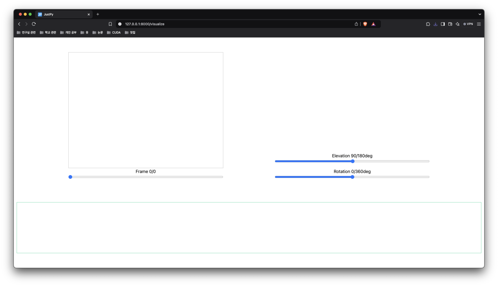

# NeckNorm Front(MacOS version)

## 설치

> python : 3.10.12 \
> OS : <= Sequoia(15.0.1)

```bash
git clone https://github.com/NeckNorm/AlphaPose.git
cd AlphaPose
git checkout -t remotes/origin/macos

python -m venv .venv
source ./.venv/bin/activate

pip install -r requirements.txt

git clone https://github.com/NeckNorm/MotionBERT.git # AlphaPose 디렉토리 내부에 생성해야함
cd MotionBERT
git checkout -t remotes/origin/macos

cd .. # 다시 AlphaPose 디렉토리로 이동
```

### 가중치 다운로드

모든 경로는 `AlphaPose 디렉토리(clone 받은 디렉토리)` 기준

1. [YOLOv3](https://drive.google.com/file/d/1D47msNOOiJKvPOXlnpyzdKA3k6E97NTC/view) 모델의 가중치를 다운로드

다운받은 가중치는 `detector/yolo/data` 디렉토리를 만든 뒤, 저장

2. [Halpe26 + ResNet50 + YOLOv3 + 256x192](https://drive.google.com/file/d/1S-ROA28de-1zvLv-hVfPFJ5tFBYOSITb/view) 모델의 가중치를 다운로드

다운받은 가중치는 `pretrained_models` 디렉토리에 저장.

3. [MotionBERT 3D Pose (H36M-SH, ft)](https://onedrive.live.com/?authkey=%21ABOq3JHlmyCLz9k&id=A5438CD242871DF0%21170&cid=A5438CD242871DF0) 모델의 가중치를 다운로드

다운받은 가중치는 `MotionBERT/weights` 디렉토리를 생성 후, 이름을 `MB_ft_h36m.bin`으로 바꾼 뒤 저장

## 사용법

```bash
cd web
python main.py
```

데이터 생성 페이지는 `http://127.0.0.1:8000/collection`

데이터 시각화 페이지는 `http://127.0.0.1:8000/visualize`

### 데이터 생성


생성 설정 설명
- 화면 캡처 주기(fps) : 기본값은 웹캠의 fps, 조절 가능 (웹캠의 fps를 넘길 수 없음)
- 생성 길이 : 설정할 경우, 설정된 화면 캡처 주기를 기준으로 `생성 프레임 개수가 자동 계산`됨
- 생성 프레임 개수 : 설정할 경우, 설정된 화면 캡처 주기를 기준으로 `생성 길이가 자동 계산`됨
- 3D pose 배치 크기 : `크기는 3D pose 성능 및 데이터 생성 속도와 비례`, 기본값은 3 (5 이상 설정할 경우, 데이터 생성 속도가 엄청나게 느려질 수 있음)


데이터 수집하기를 누른 뒤, 수집이 끝날 경우 저장된 데이터 목록에 나타남.
- 생성된 데이터의 저장 버튼을 누르면 json 형식으로 다운로드 가능

### 데이터 시각화



밑의 초록 부분으로 파일을 마우스로 끌어다 놓으면, 저장한 데이터가 업로드됨


업로드된 데이터를 클릭하면 시각화 가능

## 3D Keypoint 정보


- 10 : 머리 맨 위
- 9 : 코
- 8 : 턱
- 11 : 왼쪽 어깨
- 14 : 오른쪽 어깨